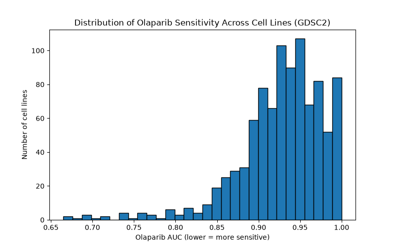

# DepMap Drug Sensitivity Prediction

## Overview
This project explores whether gene expression and mutation data from cancer cell lines can predict sensitivity to a specific drug, using public data from the [DepMap Portal](https://depmap.org/portal/download).

## Goal
Build a model that classifies cell lines as **sensitive** or **resistant** to a chosen drug, based on their molecular profile (gene expression + mutation status).

## Data Sources
All data from DepMap Portal (https://depmap.org/portal/download):
- **Expression** - `OmicsExpressionTPMLogp1HumanProteinCodingGenes.csv` (26Q1) - gene expression (TPM) per cell line
- **Mutations** - `OmicsSomaticMutationsMatrixDamaging.csv` (26Q1) - damaging mutation status per cell line
- **Drug sensitivity** - GDSC2 AUC Matrix (Harmonized GDSC 25Q2) - Sanger; GDSC2 chosen over GDSC1 for better coverage and lower measurement variance
- **Cell line metadata** - `Model.csv` (26Q1) - cancer type, tissue of origin

## Drug Selection
**Chosen drug: Olaparib** (PARP inhibitor)

**Reasoning:**
Olaparib was selected for its well-established synthetic lethality mechanism - Olaparib inhibits PARP1/2, impairing single-strand DNA break repair. In cells with functional BRCA1/2, double-strand breaks arising from this are resolved via homologous recombinant repair (HRR). In BRCA1/2-mutant cells, HRR is impaired, so PARP inhibition leads to cell death. This gives a documented, testable genetic biomarker (BRCA1/2 mutation status) to validate later modeling results against, and BRCA/HRD-pathway mutations span multiple cancer types (ovarian, breast, pancreatic, prostate), giving reasonable sample size for a pan-cancer panel.

## PRISM vs GDSC: Dataset Choice
PRISM (Broad Institute) uses pooled, barcoded screening - many cell lines mixed per well, with viability inferred from barcode abundance. This gives broad compound coverage (thousands of drugs) not noisier measurements.
GDSC (Sanger) uses traditional individual-well screening - each cell line tested separately per drug, with viability measured directly. Smaller compound library, but more precise, directly-measured data.
**GDSC was chosen** for its direct measurement approach and strong existing biomarker literature for Olapaarib. This is objective-dependant: GDSC suits this project's narrow, hypothesis-driven goal (one drug, one known biomarker). A broader, exploratory screen without a predetermined drug would favour PRISM's larger compound coverage instead.
 
## GDSC1 vs GDSC2: Dataset Choice
Both GDSC1 and GDSC2 are separate Sanger drug screening rounds using different assay technologies. Olaparib is present in both screening rounds with a shared compoundID: DPC-004744 and different per-screen SampleIDs, GDSC1:1495 and GDSC2:1017.
Compared coverage and variability before choosing:
||GDSC1|GDSC2|
|---|---|---|
|Cell lines (non-missing AUC)|879|944|
|Mean AUC|0.925|0.927|
|Std dev|0.078|0.052|
|Min|0.407|0.665|
 
**GDSC2 was chosen over GDSC1** - larger sample size and tighter measurement variance (consistent with GDSC2's more precise CellTiter-Glo assay vs GDSC1's older Systo60 method), giving cleaner data with no real tradeoff in this case.

## Project Status
In progress - drug chosen (Olaparib), response data isolated (GDSC2), distribution plotted

## Environment Setup
```bash
conda create -n port1 python=3.11 pandas numpy scikit-learn matplotlib seaborn scipy jupyter -y
conda activate port1
```

## Code: Isolating Olaparib Response Values
```python
>>> import pandas as pd
>>> conditions1 = pd.read_csv("GDSC1Log2ViabilityConditions.csv")
>>> conditions2 = pd.read_csv("GDSC2Log2ViabilityConditions.csv")
>>> auc1 = pd.read_csv("GDSC1AUCMatrix.csv",index_col=0)
>>> auc2 = pd.read_csv("GDSC2AUCMatrix.csv",index_col=0)
>>> olaparib1_info = conditions1[conditions1["CompoundName"].str.upper() == "OLAPARIB"]
>>> print(olaparib1_info[["CompoundName","SampleID","CompoundID"]].drop_duplicates())
>>> olaparib2_info = conditions2[conditions2["CompoundName"].str.upper() == "OLAPARIB"]
>>> print(olaparib2_info[["CompoundName","SampleID","CompoundID"]].drop_duplicates())
>>> target_id1 = "DPC-004744"
>>> matches1 = [c for c in auc1.columns if target_id1 in str(c)]
>>> print(matches1)
>>> target_id2 = "DPC-004744"
>>> matches2 = [c for c in auc2.columns if target_id2 in str(c)]
>>> print(matches2)
>>> olaparib_values1 = auc1[matches1[0]].dropna()
>>> olaparib_values2 = auc2[matches2[0]].dropna()
>>> print(f"Total cell lines with Olaparib data (GDSC1): {len(olaparib_values1)}")
>>> print(f"Total cell lines with Olaparib data (GDSC2): {len(olaparib_values2)}")
>>> print(olaparib_values1.describe())
count    879.000000
mean       0.924584
std        0.077692
min        0.407111
25%        0.891003
50%        0.939235
75%        0.985516
max        1.000000
Name: DPC-004744, dtype: float64
>>> print(olaparib_values2.describe())
count    944.000000
mean       0.927223
std        0.052482
min        0.664897
25%        0.902797
50%        0.935165
75%        0.962145
max        1.000000
Name: DPC-004744, dtype: float64
```

## Code: Plotting the Distribution
```
>>> import matplotlib.pyplot as plt
>>> plt.figure(figsize=(8,5))
>>> plt.hist(olaparib_values2, bins=30, edgecolor='black')
>>> plt.xlabel("Olaparib AUC (lower = more sensitive)")
>>> plt.ylabel("Number of cell lines")
>>> plt.title("Distribution of Olaparib Sensitivity Across Cell Lines (GDSC2)")
>>> plt.show()
```

## Figures
Figure 1: Distribution of Olaparib sensitivity (AUC) across 944 cell lines (GDSC2)


## Results: Response Distribution
As observed in Figure 1 - The distribution of Olaparib Sensitivity Across Cell Lines (GDSC2), the histogram visualizes a left-skewed and unimodal distribution. Most cell lines clustered between AUC 0.9 - 1.0, with a smaller tail towards the lower AUC values (lowest AUC = 0.66). These 944 cell lines' mean AUC = 0.927 and std AUC = 0.0525. This reflects that the majority of the cell lines had higher cell viability across the dose range and were resistant to the drug. This observation is due to the breadth and lack of selection in the cancer panel; BRCA1/2 or other HR-pathway mutations are only present in a minority of cases. It is hypothesized that the histogram’s tail is enriched for cell lines carrying BRCA1/2 or other HR-pathway mutations - a question that will be directly tested once mutation status data is merged in Days 5-7.

## Repository Structure
- `README.md` - project documentation and log
- 'figures/' - saved plots and visualizations

## Log
- **Day 1** - Project initialized, environment set up, GitHub repo created.
- **Day 2** - Downloaded DepMap 26Q1 data (mentioned in data sources). Chose PRISM over GDSC for broader compound coverage; chose AUC over IC50 for more robust sensitivity summary across the dose-response curve.
- **Day 3** - Pivoted from PRISM to GDSC to focus on a better-characterized drug–cell line sensitivity dataset for the analysis. Selected Olaparib as the target drug (PARP inhibitor, BRCA1/2 synthetic lethality biomarker). Compared Olaparib coverage in GDSC1 vs GDSC2; chose GDSC2 (944 cell lines, tighter variance). Isolated AUC response values, plotted their distribution, and found a left-skewed, unimodal pattern consistent with expected biology.
